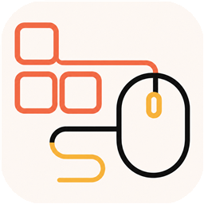

  

<h1 align="center">KeyMouse Studio</h1>

  Local keyboard & mouse automation for Windows 
  Auto-click · Timed click · Record · Script edit & playback

  <a href="./README.md">中文</a>

  
  
  
  
  

## Download & install

1. Open the [latest Release](https://github.com/Geo-ff/keymouse-studio/releases/latest)
2. Download **`KeyMouse-Studio-Setup-*.exe`**
3. Install and launch **KeyMouse Studio**

If GitHub is slow, use the [domestic download mirror (Quark Drive)](./docs/domestic-download.en.md).

**Requirements**: Windows 10 / 11 (x64)

**Notes**:

- The installer includes the runtime you need — **no** separate Python install
- Builds may be **unsigned**; Windows SmartScreen may warn you — choose **More info** → **Run anyway**
- Prefer this repository's GitHub Releases; use the Quark mirror when GitHub is hard to reach
- **Official source**: GitHub user `Geo-ff` / repository `keymouse-studio`

## Quick start

1. Install and open the app
2. Use the sidebar: **Auto-clicker / Timed / Recording / Scripts**, etc.
3. Configure and start; use **Emergency stop** when needed (default **F12**)
4. Menu **File → About & Check for Updates**, or the toolbar **About & Updates** button, for version, updates, and the official repository

## Features

| Feature | What it does |
| --- | --- |
| Auto-clicker | Click at a set interval (count or continuous; coordinates or current position) |
| Timed click | Click after a delay |
| Recording | Capture keyboard/mouse input into an editable script |
| Script editor | Add, edit, reorder, enable/disable actions |
| Playback | Replay with speed and loops; pause / resume / stop |
| Script manager | Save, load, duplicate, and delete local scripts |
| Safety | Global emergency stop; best-effort release of held keys/buttons |
| Auto-update | Checks for new versions after launch; manual check in About |

**Not in the current version**: cloud sync, accounts, online script marketplace, macOS / Linux, image recognition / OCR, and similar.

## Auto-update

- Official installers check [GitHub Releases](https://github.com/Geo-ff/keymouse-studio/releases) in the background after startup
- When an update is available, you can download it; progress is shown in the UI
- After download, restart to install now, or install later
- You can also **Check for updates** in the About dialog

## Important

- The app simulates input **on this machine** — use it only where you are allowed to
- Follow OS, game, site, and software terms, and applicable law; misuse is your responsibility
- Scripts stay **local**; the app does not upload them to a cloud service
- Emergency-stop hotkey is configurable; confirm it works before long runs

## Support the project

This project is free and open source, developed and maintained by an individual in their spare time. If you find it useful, giving it a [Star](https://github.com/Geo-ff/keymouse-studio) is the best way to support the work behind it.

## Community acknowledgment

Thanks to the [LINUX DO](https://linux.do) community for providing a friendly and open space for open-source projects, and to its members for their interest in and support for KeyMouse Studio.

## Feedback

For bugs or suggestions, you can:

- Submit a [GitHub Issue](https://github.com/Geo-ff/keymouse-studio/issues)
- Scan the QR code below with WeChat to join the **KeyMouse Studio Feedback Group**

  

> The WeChat group QR code is valid until **July 24, 2026**. If it expires, please ask the maintainer to update it through GitHub Issues.

## For developers

Building, testing, and packaging:

- [Development & build guide](./docs/development.md)
- [Project tracker](./docs/project-tracker.md)
- [Backend design](./docs/backend-design.md)

Stack: Electron · React · TypeScript · Python (FastAPI)

## License

[MIT License](./LICENSE)
